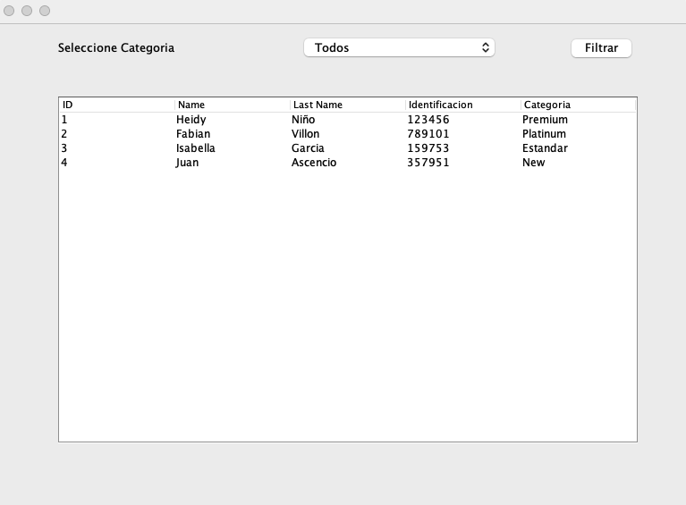

# Supermercado


Aplicacion  en `Java` para consultar y filtrar clientes por categoria realizada por favillon y hnino


## Requerimientos 

- Requiere tener Java
- Mysql o Docker con docker-composer
- JDBC 


Java version 

```shell
openjdk 23.0.1 2024-10-15
OpenJDK Runtime Environment (build 23.0.1+11-39)
OpenJDK 64-Bit Server VM (build 23.0.1+11-39, mixed mode, sharing)
```

MYSQL
```shell
8.0.40
```

Docker - Docker-compose

```shell
docker --version && docker-compose -v
Docker version 27.3.1, build ce12230
Docker Compose version 2.30.3
```shell


JDBC
```shell
mysql-connector-j-9.0.0.jar
```


## Funcionamiento

Funcionamiento si cuentas ya con el Servidor de MYSQL

> Para el funcionamiento requiere tener conexion a la BD en MYSQL, puedes tener un servidor y hacer los cambios de parametros de conexion  en el archivo `/src/supermercado/Config/DataConfig.java` posterior ejecutar  el script `/src/supermercado/docker/init.sql`

Funcionamiento si no cuentas con el servidor MYSQL pero tienes instalado Docker y Dokcer Composer

> Si no cuentas con el servidor de MYSQL  puedes optar por levantar el contenedor MYSQL  `src/supermercado/docker/docker-compose.yml` aca estableces los datos para la conexion 


Levantar la BD, ubicado en la carpeta `/src/supermercado/docker/`

```shell
docker-compose up -d
```

Para validar la conexion establecer conexion por medio de un UI o conexion por consola 

Contenedor levantado

```shell
 docker ps
CONTAINER ID   IMAGE       COMMAND                  CREATED       STATUS       PORTS                               NAMES
39b8ec19274e   mysql:8.0   "docker-entrypoint.s…"   4 hours ago   Up 4 hours   0.0.0.0:3306->3306/tcp, 33060/tcp   bd_mysql_container
```

```shell
docker exec -it bd_mysql_container /bin/bash
bash-5.1# mysql
bash-5.1# mysql -u appuser supermercado_mvc  -p
Enter password:
Reading table information for completion of table and column names
You can turn off this feature to get a quicker startup with -A

Welcome to the MySQL monitor.  Commands end with ; or \g.
Your MySQL connection id is 25
Server version: 8.0.40 MySQL Community Server - GPL

Copyright (c) 2000, 2024, Oracle and/or its affiliates.

Oracle is a registered trademark of Oracle Corporation and/or its
affiliates. Other names may be trademarks of their respective
owners.

Type 'help;' or '\h' for help. Type '\c' to clear the current input statement.

mysql> select version();
+-----------+
| version() |
+-----------+
| 8.0.40    |
+-----------+
1 row in set (0.00 sec)
```

Ya activa la BD proceder a ejecutar la aplicacion `/src/supermercado/Supermercado.java`

## Visualizacion APP

